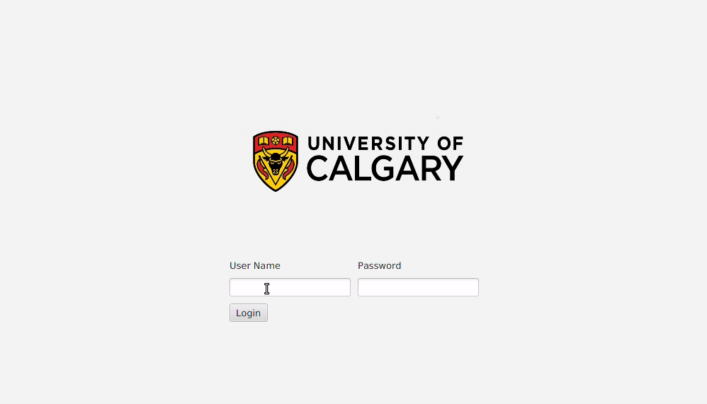

# course-management-software
  

This is a JavaFX application for managing courses, departments, majors, and concentrations for a university. This repository contains sample data for testing this application.

The administrator view will allow the user to modify the content, which will allow them to add new Courses, Programs, Departments as well as modify existing ones. The student view will allow the user to view the courses in each of the departments and programs. They can view the prerequisites, antirequisites, and descriptions for any courses they are interested in.  

## Run this project  
Maven can be used to build/run this program through the command line.  
To run this project, input the following command while in the project directory.

    mvn clean javafx:run

Alternatively this project can be imported into IntelliJ to  build and run.

**Default Credentials**  
For the administrator user:  
username: admin  
password: admin

For the student user:  
username: student  
password: student

## Credits  
**Icons**  
The icons are from Font Awesome and were converted into png files [fontawesome.com/license](https://fontawesome.com/license)

**Maven**  
The maven build files that I have modified for this project can be found at  
[github.com/openjfx/samples/tree/master/IDE/IntelliJ/Modular/Maven](https://github.com/openjfx/samples/tree/master/IDE/IntelliJ/Modular/Maven)   Copyright (c) 2019, Gluon
